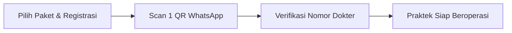
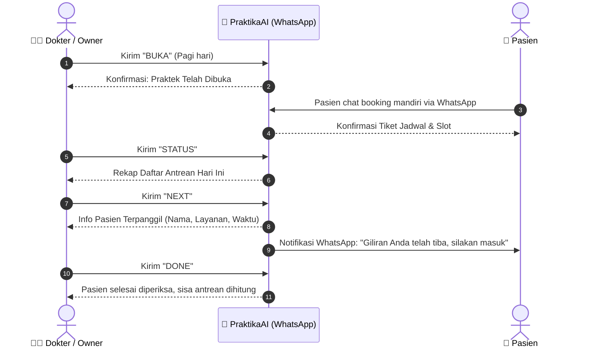

# Method of Procedure (MOP)
## Panduan Operasional Dokter & Pemilik Usaha — PraktikaAI (Zero-Web AI Receptionist)

> **Dokumen ID:** MOP-PRAKTIKA-01  
> **Target Pengguna:** Dokter Praktik Mandiri, Pemilik Klinik, Salon, Barbershop, Spa & Usaha Berbasis Reservasi  
> **Platform Interaksi:** WhatsApp Langsung (Tanpa Web/Aplikasi Tambahan)  
> **Status:** Siap Digunakan (Production Ready)

---

## 1. Pendahuluan & Filosofi Kerja

**PraktikaAI** dirancang dengan prinsip **Zero-Web UI**. Dokter dan staf tidak perlu membuka laptop, mengingat kata sandi, atau berpindah-pindah aplikasi saat sedang melayani pasien. 

Seluruh siklus reservasi pasien ditangani secara mandiri oleh asisten AI 24/7 di WhatsApp, sementara dokter cukup mengendalikan antrean dan jadwal langsung dari aplikasi WhatsApp di ponsel pribadi melalui fitur **Kopilot Dokter (Doctor Copilot)**.

---

## 2. Fase 1: Onboarding & Setup Awal (Day-0)

Tahap ini hanya dilakukan **sekali** saat pertama kali berlangganan.

### Langkah 2.1: Registrasi & Pengaturan Identitas Usaha
1. Buka laman pendaftaran PraktikaAI.
2. Pilih paket yang sesuai kebutuhan bulanan Anda (**Free, Starter, Pro,** atau **Business**).
3. Masukkan data dasar:
   * **Nama Usaha / Klinik / Praktik** (Contoh: *Klinik dr. Rian Pratama*).
   * **Kategori Usaha** (Dokter Umum, Dokter Gigi, Salon, dsb.).
   * **Nomor WhatsApp Bisnis/Resepsionis** (Nomor yang akan berinteraksi dengan pasien).
   * **Nomor WhatsApp Pribadi Dokter/Owner** (Nomor *authorized* untuk perintah kendali Kopilot).
   * **Daftar Layanan & Estimasi Durasi** (Contoh: *Konsultasi Umum - 15 menit*, *Scaling Gigi - 45 menit*).

### Langkah 2.2: Sinkronisasi WhatsApp (Scan 1 QR Code)
1. Sistem akan menampilkan **1 QR Code** khusus di layar pendaftaran (atau dikirimkan ke email Anda).
2. Buka aplikasi WhatsApp pada ponsel nomor bisnis/resepsionis Anda:
   * Masuk ke **Pengaturan** (Settings) > **Perangkat Tertaut** (Linked Devices).
   * Klik **Tautkan Perangkat** (Link a Device).
   * Arahkan kamera ponsel ke QR Code yang muncul di layar.
3. Setelah tanda centang hijau muncul, bot asisten resepsionis langsung aktif dan siap membalas chat pasien secara otomatis 24 jam.

---

## 3. Fase 2: Alur Operasional Harian (Day-to-Day Operation)

Semua tindakan dilakukan dengan mengirimkan pesan WhatsApp ke nomor resepsionis dari **nomor WhatsApp dokter/owner yang sudah terdaftar**.

### 3.1 Ringkasan Perintah Cepat Kopilot Dokter (Command Palette)

| Perintah WhatsApp | Alternatif Kata | Fungsi / Dampak Sistem |
|---|---|---|
| `BUKA` | `AKTIF` | Membuka sesi penerimaan booking baru hari ini. |
| `STATUS` | `ANTREAN`, `DAFTAR` | Melihat urutan seluruh pasien & jadwal konsultasi hari ini. |
| `NEXT` | `BERIKUTNYA`, `PANGGIL` | Memanggil pasien berikutnya & otomatis mengirim pesan WhatsApp ke pasien agar masuk ruang periksa. |
| `DONE` | `SELESAI` | Menandai pasien saat ini telah selesai dan mengosongkan ruang konsultasi. |
| `SKIP` | — | Melewati pasien yang tidak hadir/no-show dan langsung lanjut ke antrean berikutnya. |
| `TUTUP` | `ISTIRAHAT`, `PAUSE` | Menutup sementara pendaftaran booking baru (misal dokter sedang istirahat/operasi). |
| `DASHBOARD` | `RINGKASAN`, `INSIGHT` | Melihat total pasien, persentase kehadiran, estimasi omzet, dan grafik visual harian. |

---

## 4. Prosedur Operasional Terinci

### Prosedur 1: Membuka Praktek di Pagi Hari
1. Buka WhatsApp dari nomor pribadi Anda.
2. Kirim pesan: `BUKA`
3. Bot akan membalas:  
   *`🟢 PRAKTEK TELAH DIBUKA KEMBALI. ZeroWeb AI Receptionist aktif kembali menerima reservasi pasien baru.`*
4. Untuk mengecek daftar pasien yang sudah memesan slot hari ini, ketik: `STATUS`

### Prosedur 2: Memanggil Pasien Masuk Ruang Konsultasi
1. Ketika dokter siap menerima pasien pertama / berikutnya, ketik: `NEXT`
2. **Sistem secara simultan akan:**
   * Menampilkan nama pasien, nomor WhatsApp, jenis layanan, dan waktu jadwal ke chat dokter.
   * Pasien sebelumnya (jika ada) otomatis ditandai `SELESAI`.
   * **Mengirim WhatsApp otomatis ke ponsel pasien:**  
     *`"Halo Kak [Nama Pasien], giliran Anda di [Nama Klinik] sudah tiba. Silakan langsung menuju ruang konsultasi dokter ya."`*

### Prosedur 3: Menyelesaikan Sesi Konsultasi
1. Setelah konsultasi/tindakan fisik selesai, ketik: `DONE`
2. Sistem mencatat waktu selesai konsultasi, mencatat riwayat layanan, dan menginformasikan sisa pasien yang menunggu di ruang antrean.
3. *Catatan Efisiensi:* Dokter juga bisa langsung mengetik `NEXT` tanpa `DONE` terlebih dahulu; sistem akan otomatis menyelesaikan pasien sebelumnya.

### Prosedur 4: Fitur Pengingat Otomatis (Smart Nudge)
* Jika sesi pemeriksaan berlangsung melampaui batas wajar (misal lebih dari 20 menit), bot akan mengirimkan pesan pengingat halus (*Smart Nudge*) ke WhatsApp dokter:
  > *`⚠️ SMART NUDGE: Konsultasi dengan Bpk. Hendra sudah berjalan 22 menit. Ketik DONE jika sudah selesai untuk memanggil pasien berikutnya.`*
* Ini membantu dokter menjaga ketepatan waktu antrean tanpa perlu melihat jam dinding secara konstan.

---

## 5. Prosedur Penanganan Kasus Khusus (Exception Handling)

### Kasus A: Pasien Tidak Hadir / Batal Mendadak (No-Show)
Jika pasien yang dipanggil tidak muncul di ruang periksa setelah 5–10 menit:
1. **Langkah Dokter:** Cukup ketik `NEXT` atau `SKIP`.
2. **Respon Sistem:**
   * Pasien yang tidak hadir otomatis diubah statusnya menjadi dilewati (*Skipped / Cancelled*).
   * Sistem langsung memanggil nomor antrean berikutnya dan mengirim notifikasi WhatsApp kepada pasien selanjutnya.
   * Pasien yang no-show akan menerima pesan ramah otomatis:  
     *`"Halo Kak [Nama], jadwal Anda hari ini telah terlewat. Jika ingin menjadwalkan ulang ke hari lain, silakan balas chat ini ya."`*
3. **Catatan Kuota:** Kuota booking bulanan klinik tetap terhitung karena slot telah dialokasikan sejak awal reservasi.

### Kasus B: Pasien Ingin Reschedule (Pindah Jadwal Mandiri)
1. Pasien tidak perlu menelepon staf klinik. Pasien cukup mengirim pesan ke WhatsApp resepsionis: *"Saya mau ganti jam"* atau *"Reschedule jadwal"*.
2. Asisten AI akan memverifikasi tiket lama, mengecek ketersediaan slot dokter yang kosong, dan memperbarui jadwal secara otomatis tanpa mengganggu dokter.

### Kasus C: Pasien Datang Langsung Tanpa Booking (Walk-In / Darurat)
1. Jika ada pasien darurat atau pasien lansia yang langsung datang tanpa WhatsApp:
   * Dokter atau asisten cukup melayani langsung.
   * Saat giliran mereka, dokter tidak perlu mengirim perintah `NEXT` ke bot, atau biarkan slot tetap berjalan.
   * Jika ingin dicatat ke sistem, asisten/resepsionis cukup mengirim chat singkat dari nomor pasien tersebut ke bot untuk booking di jam terdekat.

### Kasus D: Dokter Perlu Istirahat / Rapat Mendadak
1. Ketik: `TUTUP` atau `PAUSE`
2. Pasien yang mencoba melakukan booking pada jam tersebut akan menerima informasi otomatis bahwa praktek sedang rehat sementara waktu dan disarankan memilih slot berikutnya.
3. Setelah selesai istirahat, ketik `BUKA` untuk mengaktifkan kembali.

---

## 6. Prosedur Akhir Hari & Laporan Keuangan

Sebelum meninggalkan ruang praktek di malam hari:
1. Kirim pesan: `DASHBOARD` atau `RINGKASAN`
2. Bot akan menyajikan laporan lengkap:
   * **Total Pasien Dilayani Hari Ini** (Selesai vs Batal).
   * **Estimasi Pendapatan Harian** berdasarkan tindakan medis yang telah selesai.
   * **Tautan Grafik Visual (Chart Bar)** yang memperlihatkan rasio performa harian klinik.
3. Kirim pesan `TUTUP` jika praktek telah selesai hingga keesokan harinya.

---

## 7. Panduan Interaksi AI Copilot (Natural Language)

Bagi pengguna paket **Free, Starter, Pro, maupun Business**, sistem sudah dilengkapi kemampuan **AI Copilot (Free text / NLP)**. Dokter tidak harus mengetik perintah kaku dalam huruf kapital, melainkan bisa mengetik santai seperti mengobrol dengan asisten pribadi:

* *"Dok tolong panggil pasien berikutnya ya"* ➡️ Sistem memproses perintah **NEXT**.
* *"Tutup dulu ya saya mau istirahat makan siang"* ➡️ Sistem memproses perintah **TUTUP**.
* *"Tolong rangkum pasien hari ini dan omzetnya"* ➡️ Sistem memproses perintah **DASHBOARD**.
* *"Siapa saja yang antre sore ini?"* ➡️ Sistem memproses perintah **STATUS**.

---

## 8. Panduan Troubleshooting Cepat

| Kendala | Penyebab Umum | Solusi Cepat |
|---|---|---|
| **Pesan perintah tidak dibalas sama sekali** | Sesi WhatsApp di HP bisnis terputus atau ponsel mati. | Pastikan ponsel bisnis terhubung ke internet. Buka menu Perangkat Tertaut di WA, pastikan statusnya masih aktif. Jika terputus, cukup lakukan scan QR ulang. |
| **Balasan: "Unauthorized doctor phone"** | Perintah dikirim dari nomor HP yang belum didaftarkan di whitelist dokter. | Kirimkan perintah hanya dari nomor WhatsApp dokter/owner yang didaftarkan saat pendaftaran awal. |
| **Pasien mengeluh slot penuh padahal ruang tunggu sepi** | Status praktek masih dalam mode `TUTUP`. | Ketik `BUKA` di WhatsApp dokter untuk mengizinkan pasien baru melakukan reservasi. |
| **Kuota booking habis di tengah bulan** | Jumlah booking telah mencapai batas paket bulanan (misal 25 di Free / 80 di Starter). | Buka halaman akun untuk melakukan *upgrade* ke paket yang lebih tinggi (Pro / Business) agar kuota langsung bertambah seketika. |

---

*Dokumen MOP ini adalah hak milik penyedia layanan dan dibuat sebagai acuan standar operasional mitra dokter & pemilik usaha PraktikaAI.*
