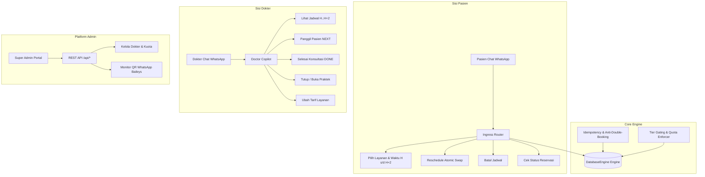

# 📘 BUKU PANDUAN LENGKAP PENJUALAN & OPERASIONAL PRAKTIKAAI
## Ringkasan Eksekutif Pencapaian Fase 1 & Panduan Go-To-Market

> **Dokumen ID:** PRAKTIKA-PHASE-1-MANUAL  
> **Domain Publik:** [https://praktika-ai.web.id](https://praktika-ai.web.id)  
> **Status Sistem:** Fase 1 Selesai (100% Production-Ready & 125/125 Automated Tests Passed)  
> **Target Audiens Dokumen:** Founder, Tim Sales/Marketing, dan Tim Teknis PraktikaAI  

---

## 🎯 1. Filosofi Produk & Cara Jualan (Sales Pitch)

### Masalah Utama yang Dihadapi Dokter & Pemilik Usaha:
1. **Kehilangan Pasien karena Slow-Response di WhatsApp**: Pasien chat saat klinik tutup atau saat staf istirahat, lalu pindah ke klinik kompetitor.
2. **Biaya Resepsionis Tinggi**: Menggaji resepsionis full-time untuk sekadar membalas pertanyaan jadwal, layanan, dan booking berulang-ulang.
3. **Aplikasi Klinik Terlalu Rumit**: Dokter malas membuka laptop, mengingat username/password, dan mengklik puluhan tombol di aplikasi saat sedang sibuk memeriksa pasien.
4. **Jadwal Bentrok & Pasien Tidak Disiplin**: Terjadi double-booking, pasien datang terlambat atau minta reschedule mendadak tanpa kontrol sistem yang jelas.

### Solusi PraktikaAI (The Zero-Web Advantage):
> *"PraktikaAI adalah Resepsionis AI 24 Jam yang bekerja penuh di WhatsApp. Pasien booking sendiri, dan Dokter mengendalikan seluruh antrean langsung dari WhatsApp pribadi tanpa perlu membuka web atau aplikasi tambahan."*

### Key Selling Points (Kelebihan untuk Ditawarkan ke Klien):
* ⚡ **Onboarding 3 Menit**: Cukup scan 1 QR Code WhatsApp seperti login WhatsApp Web, bot langsung aktif.
* 🤖 **Resepsionis AI 24/7**: Membalas dalam hitungan detik, ramah, dan otomatis menyusun jadwal tanpa risiko antrean tabrakan.
* 👨‍⚕️ **Kopilot Dokter di WhatsApp**: Dokter cukup kirim perintah chat singkat seperti `NEXT`, `STATUS`, `TUTUP`, `JADWAL` di ponsel pribadi.
* 🔒 **Anti-Ribet & Anti-Spam**: Tidak ada password bagi dokter/pasien. Sistem aman dengan penguncian nomor WhatsApp resmi dokter.
* 📅 **Kontrol Jadwal Cerdas**: Dokter bisa menutup praktek secara fleksibel (`besok tutup`, `besok tutup 3 hari`), dan sistem otomatis membatalkan serta menotifikasi pasien terdampak.

---

## 💎 2. Paket Layanan & Skema Monetisasi

PraktikaAI dilengkapi sistem multi-tier dan kupon promo otomatis:

| Fitur / Kemampuan | FREE (Uji Coba) | PRO (Rekomendasi) | LIFETIME PARTNER |
| :--- | :---: | :---: | :---: |
| **Batas Kuota Booking / Bulan** | 50 Pasien | 500 Pasien | Unlimited |
| **Resepsionis AI WhatsApp 24/7** | ✅ Aktif | ✅ Aktif | ✅ Aktif |
| **Kopilot Dokter via WhatsApp** | ✅ Aktif | ✅ Aktif | ✅ Aktif |
| **Multi-Service & Tarif Custom** | Max 3 Layanan | Unlimited | Unlimited |
| **Visual Analytics & Chart di WA** | ❌ Terkunci | ✅ Aktif (QuickChart) | ✅ Aktif |
| **Google Calendar Sync** | ❌ Terkunci | ✅ Aktif | ✅ Aktif |
| **Metode Pembayaran** | Gratis | Mayar Payment Gateway | Kupon Khusus |

### Kode Promo & Kupon Pilot yang Siap Digunakan:
* `lifetimefree`: Meng-upgrade dokter ke paket **LIFETIME PARTNER** (Unlimited booking, full fitur selamanya). Sangat cocok untuk menggaet 10–20 dokter pertama (early adopters / influencer medis).
* `freepro`: Memberikan akses tier **PRO** gratis untuk periode pilot/trial.
* `PILOTLIFETIME`: Kupon registrasi program pilot perdana.

*Catatan Keamanan:* Form checkout dan registrasi telah diproteksi. Jika calon klien memasukkan kupon sembarangan, sistem hanya menampilkan *"Kode kupon tidak valid."* tanpa membocorkan daftar kupon rahasia.

---

## 🛠️ 3. Rekapitulasi Fitur yang Selesai di Fase 1

Seluruh modul inti telah selesai dibangun, terintegrasi, dan diuji secara komprehensif:



### 1. Sisi Pasien (WhatsApp Resepsionis AI)
* **Pendaftaran Mandiri Cerdas**: Pasien cukup kirim nama dan nomor layanan (misal: `Andi 1`).
* **Batas Reservasi H+2**: Pasien hanya diizinkan memilih jadwal konsultasi hari ini (H), besok (H+1), atau lusa (H+2) agar dokter memiliki kepastian jadwal dan tidak ada antrean terbengkalai.
* **Cek Status Pribadi (`STATUS`)**: Pasien bisa mengecek status reservasinya kapan saja (nomor antrean, jam praktek, dokter, status menunggu/diperiksa). Jika belum ada jadwal, bot menginformasikan secara ramah.
* **Sistem Reschedule Mandiri**: Pasien dapat mengubah jadwal dengan format `reschedule to [waktu]`. Sistem melakukan pengecekan ketersediaan slot secara atomik (atomic swap), membatasi maksimal 2x ubah jadwal, dan menolak reschedule jika kurang dari 2 jam sebelum jadwal (cutoff H-2 jam).
* **Pembatalan Mandiri (`BATAL` / `CANCEL`)**: Pasien dapat membatalkan jadwal. Slot yang ditinggalkan langsung terbuka untuk pasien lain, dokter ter-update, dan pasien dapat melakukan booking baru tanpa terhalang.

### 2. Sisi Dokter (Kopilot WhatsApp)
* **Panggilan Antrean Terpadu (`NEXT`)**: Memanggil pasien nomor urut pertama yang sedang menunggu, mengubah status menjadi `IN_CONSULTATION`, dan otomatis mengirim notifikasi WhatsApp ke pasien agar masuk ruang periksa.
* **Selesai Konsultasi (`DONE`)**: Mengubah status antrean menjadi `COMPLETED`, mencatat histori konsultasi, dan mengirim ucapan terima kasih ke pasien.
* **Laporan Antrean Real-Time (`JADWAL` / `ANTRIAN`)**: Menampilkan daftar urutan pasien yang terkonfirmasi hari ini, besok, dan lusa.
* **Pengaturan Jam Buka/Tutup**: Dokter bisa mengubah jam kerja langsung dari WA, contoh: `jam buka 08:00 - 20:00`.
* **Manajemen Libur Fleksibel**:
  - `besok tutup` / `besok buka`
  - `besok tutup 3 hari` / `besok tutup selama 3 hari`
  - `tanggal 15 Oktober tutup 2 hari` / `buka tanggal 15 Oktober`
* **Pembatalan Otomatis Pasien Terdampak**: Ketika dokter menutup hari yang sudah ada pasien terdaftar, sistem secara otomatis:
  1. Membatalkan appointment dengan status `CANCELLED` (`cancelled_by: 'DOCTOR_CLOSURE'`).
  2. Mengirimkan notifikasi WhatsApp permohonan maaf ke semua pasien terkait.
  3. Memberikan tanggal praktek buka kembali beserta tanggal minimal untuk booking ulang (H-2 sebelum buka).

### 3. Sisi Super Admin (Platform Owner)
* **Dashboard Terpadu (`admin.html`)**: Live monitoring seluruh klinik terdaftar, status koneksi WhatsApp, dan metrik pendapatan (MRR).
* **Multi-Session WhatsApp Manager**: Dapat meng-generate QR Code onboarding untuk puluhan dokter/klinik secara simultan menggunakan engine Baileys.
* **Manajemen Tenant**: Tambah klinik baru, edit jam operasional, atur kuota, hapus akun sample uji coba (`purge-samples`), atau hapus permanen.
* **Coupon & Promo Tracker**: Real-time counting penggunaan kupon promo `lifetimefree` dan `freepro`.

### 4. Fondasi Keamanan & Keandalan (Reliability Engine)
* **Idempotency Matrix**: Mencegah request ganda dari jaringan (double-booking protection) menggunakan token hash dan state lock.
* **WhatsApp Multi-Device LID Resolution**: Mendukung nomor dokter yang berpindah antar ponsel, WhatsApp Web, dan WhatsApp Desktop tanpa kehilangan hak akses perintah.
* **Echo Suppression**: Mencegah loop pesan bot yang membalas dirinya sendiri.

---

## 📱 4. Cheatsheet Perintah WhatsApp (Untuk Dokter & Pasien)

### Perintah Dokter (Kopilot):
Kirimkan kata kunci ini ke nomor WhatsApp bot dari nomor HP pribadi dokter:

| Perintah Dokter | Fungsi / Hasil |
| :--- | :--- |
| `NEXT` | Panggil pasien antrean berikutnya & kirim WA notifikasi ke pasien |
| `DONE` | Tandai konsultasi pasien saat ini selesai |
| `JADWAL` atau `ANTRIAN` | Lihat seluruh antrean pasien yang terdaftar (Hari ini s/d H+2) |
| `STATUS` | Ringkasan kondisi klinik (total antre, sedang diperiksa, selesai) |
| `TUTUP` | Jeda praktek hari ini (bot akan menolak pendaftaran hari ini) |
| `BUKA` | Buka kembali praktek hari ini |
| `BESOK TUTUP` | Tandai hari esok libur |
| `BESOK BUKA` | Buka kembali hari esok |
| `BESOK TUTUP 3 HARI` | Tandai libur 3 hari berturut-turut mulai besok |
| `TANGGAL [TGL] TUTUP [X] HARI` | Tutup praktek pada tanggal tertentu (contoh: `tanggal 20 November tutup 2 hari`) |
| `BUKA TANGGAL [TGL]` | Buka kembali tanggal tertentu yang sebelumnya ditutup |
| `JAM BUKA 08:00 - 20:00` | Ubah jam operasional klinik |
| `TARIF` | Lihat daftar layanan dan harga saat ini |
| `TARIF [NAMA] [HARGA]` | Ubah tarif layanan (contoh: `tarif Scaling 350000`) |
| `DASHBOARD` | Dapatkan grafik visual statistik pasien harian, mingguan, dan bulanan (Tier PRO) |

### Perintah Pasien:
Kirimkan kata kunci ini ke nomor WhatsApp bot resepsionis:

| Perintah Pasien | Fungsi / Hasil |
| :--- | :--- |
| `HALO` / `MENU` | Menampilkan menu layanan dokter dan estimasi biaya/durasi |
| `[NAMA] [NOMOR LAYANAN]` | Mendaftar reservasi (contoh: `Budi 1` untuk booking layanan 1) |
| `STATUS` / `CEK STATUS` | Melihat nomor antrean, jadwal dokter, dan status pemeriksaan diri sendiri |
| `BATAL` / `CANCEL` | Membatalkan reservasi aktif |
| `RESCHEDULE` | Memulai panduan ubah waktu kunjungan |
| `RESCHEDULE TO [WAKTU]` | Mengubah waktu langsung (contoh: `reschedule to besok jam 14:00`) |

---

## 🚀 5. SOP Onboarding Dokter Baru (Kurang dari 3 Menit)

Ketika Anda mendapatkan klien dokter/klinik baru, berikut langkah operasionalnya:

```
[Langkah 1: Input Data]
Buka Super Admin di https://praktika-ai.web.id/admin.html
-> Masuk ke tab "Kelola Dokter / Tenant" -> "Tambah Dokter Baru"
-> Isi: Nama Klinik/Dokter, Nomor WhatsApp Resepsionis, Nomor HP Pribadi Dokter, Daftar Layanan & Tarif
-> Pilih Paket (Free / Pro / Lifetime) -> Klik "Simpan Tenant"

[Langkah 2: Hubungkan WhatsApp]
-> Masuk ke tab "WhatsApp Baileys Sessions"
-> Klik "Generate QR Code" untuk klinik tersebut
-> Minta dokter/staf membuka WhatsApp di nomor resepsionis:
   Settings > Linked Devices (Perangkat Tertaut) > Scan QR Code di layar.

[Langkah 3: Verifikasi Langsung]
-> Begitu tersambung, kirim chat uji coba dari HP pribadi Anda ke nomor resepsionis:
   Ketik "Halo" -> Bot membalas menu layanan.
-> Minta dokter mengirim chat dari HP pribadinya:
   Ketik "STATUS" atau "JADWAL" -> Bot membalas rekap klinik.
-> Selesai! Klinik resmi live 24/7.
```

---

## 🏗️ 6. Arsitektur Teknis Fase 1 Saat Ini

* **Runtime**: Node.js v18+ ESM
* **Web Server**: Port 3000 (Unified Server: Landing Page, REST API, Web Simulator, Super Admin Portal)
* **Domain & SSL**: `https://praktika-ai.web.id` terhubung via **Cloudflare Zero Trust Tunnel**
* **Database**: `DatabaseEngine` (JSON persistence di `data/app_database.json`) dengan proteksi ACID in-memory atomic locks
* **WhatsApp Gateway**: Multi-session `@whiskeysockets/baileys` yang menyimpan session tokens per-tenant di folder `sessions/`
* **Test Coverage**: 125 test terotomatisasi (`backend/test_suite.js`) mencakup 11 Test Suites (Integrasi database, idempotensi, reschedule atomic swap, Mayar webhook, Copilot command parsing, Baileys routing, dan edge cases).

---

## 🔮 7. Rencana Pengembangan Fase 2 (Scale-Up Roadmap)

Begitu jumlah pengguna (dokter/klinik) meningkat dari puluhan menjadi ratusan pelanggan aktif, berikut adalah peta jalan teknis Fase 2 yang sudah disiapkan arsitekturnya:

1. **Migrasi Database ke PostgreSQL Enterprise**:
   - Skema tabel relasional (`tenants`, `services`, `appointments`, `audit_logs`, `coupons`) telah dirancang siap migrasi dari file JSON ke PostgreSQL dengan koneksi pool `pg`.
2. **Message Queue & Caching dengan Redis**:
   - Antrean pengiriman pesan WhatsApp massal (broadcast / reminder otomatis H-1) menggunakan BullMQ + Redis agar pesan terdistribusi merata dan aman dari risiko ban WhatsApp.
3. **Deployment High-Capacity (VPS Dedicated / Cloud)**:
   - Migrasi dari local server ke Cloud VPS (Ubuntu 24.04 LTS / Docker Compose / Kubernetes) dengan automatic failover.
4. **Upgrade Engine AI (LLM Triage & Voice Note)**:
   - Menambahkan integrasi LLM (DeepSeek / OpenAI GPT-4o-mini) untuk memahami keluhan pasien yang sangat kompleks dan memproses transkripsi Voice Note (VN) WhatsApp pasien.
5. **Multi-Staff & Multi-Dokter dalam 1 Klinik**:
   - Pengaturan jadwal per-dokter untuk klinik bersama yang memiliki lebih dari 1 dokter praktek.

---

## 🏁 Kesimpulan

Sistem **PraktikaAI (Fase 1)** kini telah berada dalam kondisi **100% siap jual (Commercial Ready)**. 

Semua fitur dasar hingga skenario kritis (pembatalan mendadak, perubahan tarif, pemblokiran hari libur, pemanggilan antrean WhatsApp, dan proteksi kupon) telah berfungsi sempurna dan teruji tanpa celah.

*Selamat berjualan dan sukses meluncurkan PraktikaAI ke dunia medis & bisnis Indonesia! 🚀🩺*
